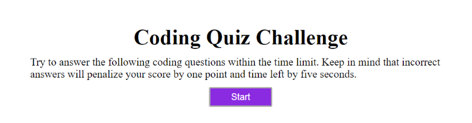
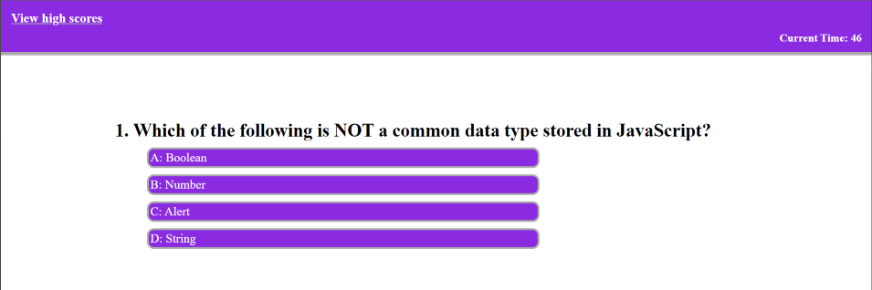
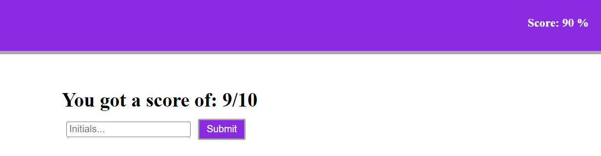

# Coding-Quiz
A timed quiz game with questions regarding JavaScript that can be used to evaluate coding knowledge. This project was made as an alternative method to learning to improve retention and understanding. This game is also a way to evaluate the user's knowledge of JavaScript.

## Installation
N/A

## Usage
To visit the webpage click [here.](https://shannonkprice00.github.io/coding-quiz/)

The inital page will display a short paragraph regarding the quiz game and it's parameters. The user will have 75 seconds to complete the 10 question quiz. Feedback will be given immediately after selecting an answer. If an incorrect answer is selected, the time left will be reduced by 5 seconds. At the end of the quiz, the user can save his or her initials and score to be able to compare to other users. 

Initial page display  

Question screenshot  

Save score display  

## Credits
Quiz Questions found at [W3Schools.](https://www.w3schools.com/quiztest/quiztest.asp?qtest=JS) 
 Tutorials Followed: 
Repo Referenced - https://github.com/CodeExplainedRepo/Multiple-Choice-Quiz-JavaScript/blob/master/quiz.js 
Using querySelectorAll - https://www.queryselectorall.com/examples 
Using Visibility questions - https://www.w3schools.com/jsref/prop_style_visibility.asp 
 Assistance: 
Tutor: Jacob Nordan 
Instructor: Tyler Calvert 

## License
MIT License